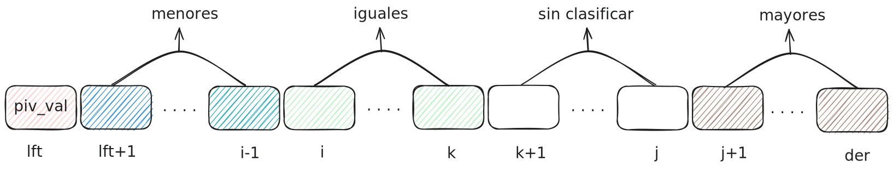

## Ejercicio 6

El procedimiento **`partition`** que se dio en clase separa un fragmento de arreglo principalmente en dos segmentos: 
- menores o iguales al pivot por un lado y
- mayores o iguales al pivot por el otro.
  
Modificar ese algoritmo para que separe en tres segmentos:
- los menores al pivot,
- los iguales al pivot y
- los mayores al pivot.

En vez de devolver solamente la variable `pivot`, deberá devolver `pivot_izq` y `pivot_der` que informan al algoritmo **`quick_sort_rec`** las posiciones inicial y final del segmento de repeticiones del pivot. Modificar el algoritmo **`quick_sort_rec`** para adecuarlo al nuevo procedimiento **`partition`**.


```bash
proc partition (in/out a:array[1..n] of T,
                in izq, der: nat,
                out pivot_izq, pivot_der: nat)
    var i,j, k: nat
    ppiv:= izq
    i:= izq
    j:= der
    k:= izq
    piv_val:= a[lft]
    while k+1 ≤ j do
        if (a[k+1] = piv_val) then
            k:= k+1
        else if (piv_val < a[k+i]) then
            swap(a, k+1, j)
            j:= j-1
        else if (a[k+1] < piv_val) then
            swap(a, k+1, i)
            i:= i+1
            k:= k+1
        fi
    od
    pivot_izq:= i 
    pivot_der:= k
end proc
```


El siguiente gráfico nos ayuda a entender mejor la idea del algorítmo y cómo debe quedar el arreglo antes de poner el pivot en su lugar:

*[Pie de imágen: se recomienda visualizar el gráfico con tema oscuro]*