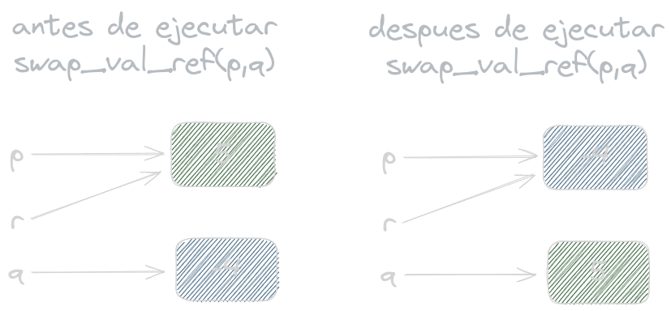
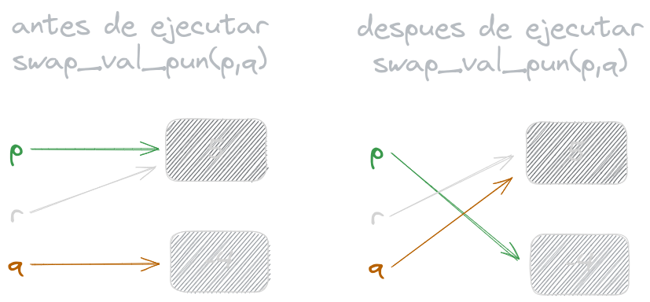

## Ejercicio 4
Dados dos punteros p,q: **pointer to int**
- a) Escribir un algoritmo que intercambie los valores referidos sin modificar los valores de p y q.
```bash
proc swap_val_ref(in/out p,q: pointer to int)
    var tmp: int
    tmp:= p
    p:= q
    q:= tmp
end proc
```
<br><br><br>

- b) Escribir otro algoritmo que intercambie los valores de los punteros.
```bash
proc swap_val_pun(in/out p,q: pointer to int)
    var tmp: int
    tmp:= *p
    *p:= *q
    *q:= tmp
end proc
```
<br><br><br>

Sea un tercer puntero r: **pointer to int** que inicialmente es igual a p, y asumiendo que inicialmente *p = 5 y *q = (-4) ¿cuáles serían los valores de *p, *q y *r luego de ejecutar el algoritmo en cada uno de los dos casos?

En swap_val_ref(p,q), los valores de los punteros serían:
- p = -4
- q = 5
- r = -4

Lo podemos ver más claro en el siguiente gráfico:



*[Pie de imagen: preferentemente ver con tema oscuro]*

<br><br>

En swap_val_pun(p,q), serían:
- p = -4
- q = 5
- r = 5

Lo podemos ver más claro en el siguiente gráfico:



*[Pie de imagen: preferentemente ver con tema oscuro]*