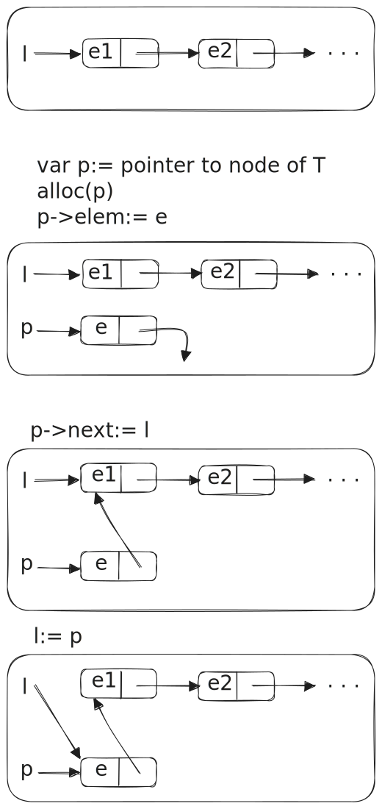
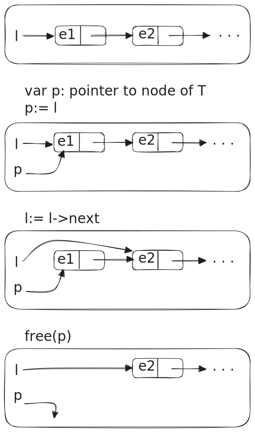
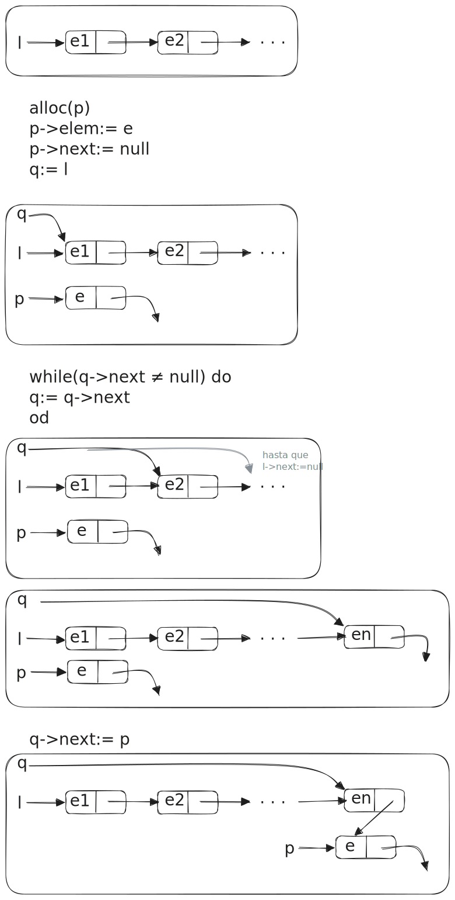
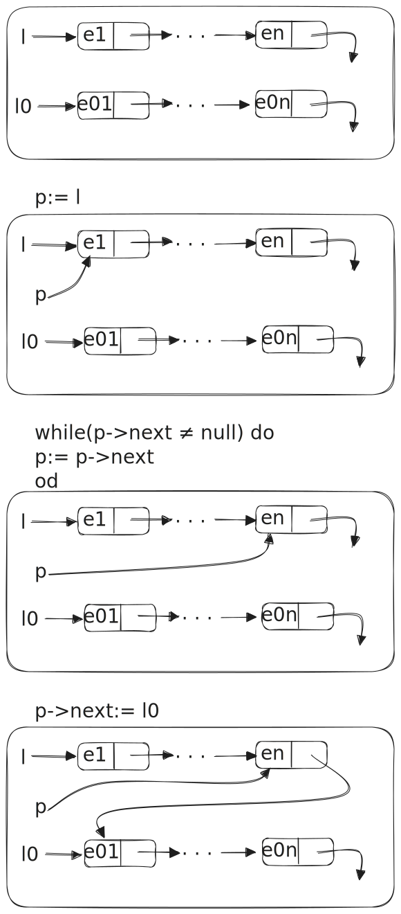
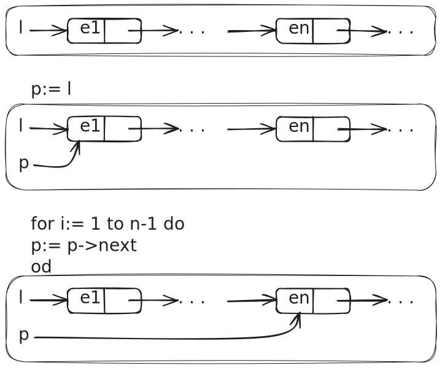
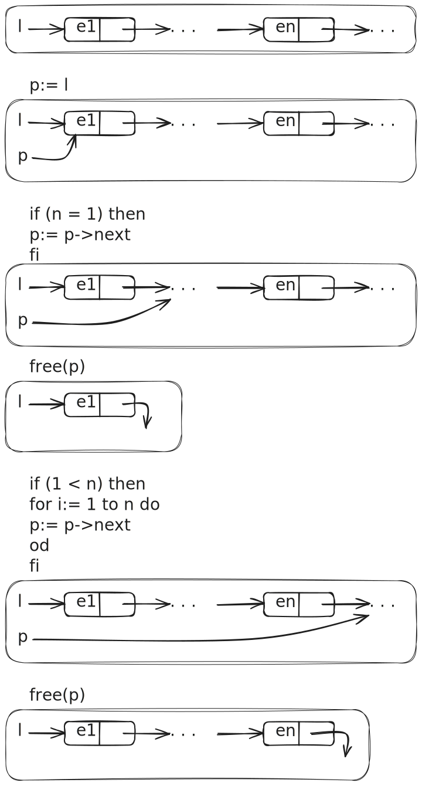

## Ejercicio 1
Completar la implementación de listas dada en el teórico usando punteros.


```bash
implement List of T where

type Node of T = tuple
                    elem: T
                    next: pointer to (Node of T)
                 end tuple

type List of T = pointer to (Node of T)
```

#### empty_list
```
fun empty_list() ret l: List of T
    alloc(l)
    l:= null
end fun
{- crea una lista vacía -}
```

#### addl
<br>
```
proc addl (in e:T, in/out l: List of T)
    var p: pointer to (Node of T)
    alloc(p)
    p->elem:= e
    p->next:= l
    l:= p
end proc
{- agrega el elemento e al comienzo de la lista l -}
```

#### destroy_list
```
proc destroy_list (in/out l: List of T)
    if (l ≠ null) then
        destroy(l->next)
        free(l)
    fi
end proc
{- libera memoria en caso que sea necesario -}
```

#### is_empty
```
fun is_empty(l: List of T) ret b: bool
    b:= (l = null)
end fun
{- Devuelve True si l es vacía -}
```

#### head
```
{- PRE: not is_empty(l) -}
fun head(l: List of T) ret e: T
    e:= l->elem
end fun
{- Devuelve el primer elemento de la lista l -}
```

#### tail
<br>
```
{- PRE: not is_empty(l) -}
proc tail(in/out l: List of T)
    var p: pointer to (Node of T)
    p:= l
    l:= l->next
    free(p)
end proc
{- Elimina el primer elemento de la lista l -}
```

#### addr
<br>

```
proc addr (in/out l: List of T, in e: T)
    var p,q: pointer to (Node of T)
    alloc(p)
    p->elem:= e
    p->next:= null
    if (l ≠ null) then
        q:= l
        while (q->next ≠ null) do
            q:= q->next
        od
        q->next:= p
    else l:= p
    fi
end proc
{- agrega el elemento e al final de la lista l -}
```

#### length
```
fun length(l: List of T) ret n: nat
    if (l = null) then n:= 0
    else
        n:= 1 + length(l->next)
    fi
end fun
{- Devuelve la cantidad de elementos de la lista l -}
```

#### concat
<br>

```
proc concat(in/out l: List of T,in l0: List of T)
    var p: pointer to (Node of T)
    if (l = null ^ l0 ≠ null) then
        l:= l0
    else
        p:= l
        while (p->next ≠ null do)
            p:= p->next
        od
        p->next:= l0
    fi
end proc
{- Agrega al final de l todos los elementos de l0 en el mismo orden -}
```

#### index
<br>
```
{- PRE: length(l) > n -}
fun index(l: List of T, n: nat) ret e: T
    var p: pinter to (Node of T)
    p:= l
    if (n > 1) then
        for i:= 1 to (n-1) do
            p:= p->next
        od
    fi
    e:= p->elem
end proc
{- Devuelve el n-ésimo elemento de la lista l -}
```

#### take
<br>
```
proc take(in/out l: List of T, in n: nat)
    var p,q: pointer to (Node of T)
    var i: nat
    i:= 0
    if (l ≠ null) then
        if (n = 0) then
            while (l ≠ null) do
                p:= l
                l:= l->next
                free(p)
            od
        else if (0 < n) then
            p:= l
            {- busco el primer elemento a eliminar -}
            while (l ≠ null ^ i < n) do
                p:= p->next
                i:= i + 1
            od
            {- elimino los elementos -}
            while (p ≠ null) do
                q:= p
                p:= p->next
                free(q)
            od
        fi
    fi
end proc
{- Deja en l sólo los primeros n elementos, eliminando el resto -}
```

#### drop
```
proc drop(in/out l: List of T, in n: nat)
    var p: pointer to (Node of T)
    var i: nat
    i:= 0
    if (l ≠ null ^ 0 < n) then
        while (l ≠ null ^ i < n) do
            p:= l
            l:= l->next
            free(p)
            i:= i + 1
        od
    fi
end proc
{- Elimina los primeros n elementos de l -}
```

#### copy_list
```
fun copy_list(l1: List of T) ret l2: List of T
    var p: pointer to (Node of T)
    var n: nat
    n:= length(l1)
    if (l1 = null) then l2:= empty()
    else
        p:= l1
        alloc(l2)
        for i:= 1 to n do
            l2->elem = p->elem
            l2->next = p->next
            p:= p->next
        od
    fi
end fun
{- Copia todos los elementos de l1 en la nueva lista l2 -}
```