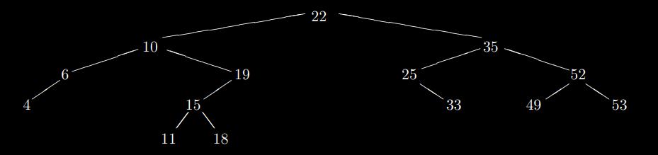

<h1 align="center" style="font-weight:bold;">Algoritmos y Estructuras de Datos II</h1>
<p align="center" style="color:gray; font-size: 20px; font-weight:bold;">Practico 2.3 - TADs: pilas y colas</p>

## Ejercicio 1 - [Solución](ej01.md)
Implementar el TAD Pila utilizando la siguiente representación:
```
implement Stack of T where

type Stack of T = List of T
```

## Ejercicio 2 - [Solución](ej02.md)
Implementar el TAD Pila utilizando la siguiente representación:
```
implement Stack of T where

type Node of T = tuple
                    elem: T
                    next: pointer to (Node of T)
                 end tuple

type Stack of T = pointer to (Node of T)
```

## Ejercicio 3 - [Solución](ej03.md)
a) Implementar el TAD Cola utilizando la siguiente representación, donde N es una constante de tipo nat:
```
implement Queue of T where

type Queue of T = tuple
                    elems: array[0..N-1] of T
                    size: nat
                  end tuple
```
b) Implementar el TAD Cola utilizando un arreglo como en el inciso anterior, pero asegurando que todas las operaciones estén implementadas en orden constante.<br>
💡Ayuda1: Quizás convenga agregar algún campo más a la tupla. ¿Estamos obligados a que el primer elemento de la cola esté representado con el primer elemento del arreglo?<br>
💡Ayuda2: Buscar en Google *aritmética modular*.

## Ejercicio 4 - [Solución](ej04.md)
Completar la implementación del tipo Arbol Binario dada en el teórico, donde utilizamos la siguiente representación:
```
implement Tree of T where

type Node of T = tuple
                    left: pointer to (Node of T)
                    value: T
                    right: pointer to (Node of T)
                 end tuple
                 
type Tree of T = pointer to (Node of T)
```

## Ejercicio 5 - [Solución](ej05.md)
Un *Diccionario* es una estructura de datos muy utilizada en programación. Consiste de una colección de pares (Clave,Valor), a la cual le puedo realizar las operaciones:
- Crear un diccionario vacío.
- Agregar el par consistente de la clave k y el valor v. En caso que la clave ya se encuentre en el diccionario, se reemplaza el valor asociado por v.
- Chequear si un diccionario es vacío.
- Chequear si una clave se encuentra en el diccionario.
- Buscar el valor asociado a una clave k. Solo se puede aplicar si la misma se encuentra.
- Una operación que dada una clave k, elimina el par consistente de k y el valor asociado. Solo se puede aplicar si la clave se encuentra en el diccionario.
- Una operación que devuelve un conjunto con todas las claves contenidas en un diccionario.

a) Especificar el TAD diccionario indicando constructores y operaciones.
```
spec Dict of (K,V) where
```
donde K y V pueden ser cualquier tipo, asegurando que K tenga definida una función que chequea igualdad.

b) Implementar el TAD diccionario utilizando la siguiente representación:
```
implement Dict of (K,V) where

type Node of (K,V) = tuple
                        left: pointer to (Node of (K,V))
                        key: K
                        value: V
                        right: pointer to (Node of (K,V))
end tuple

type Dict of (K,V)= pointer to (Node of (K,V))
```
Como invariante de representación debemos asegurar que el árbol representado por la estructura sea binario de búsqueda de manera que la operación de buscar un valor tenga orden logarítmico. Es decir, dado un nodo n, toda clave ubicada en el nodo de la derecha n.right, debe ser mayor o igual a n.key. Y toda clave ubicada en el nodo de la izquierda n.left, debe ser menor a n.key. Tener especial cuidado en la operación que agrega pares al diccionario.

## Ejercicio 6 - [Solución](ej06.md)
En un ABB cuyos nodos poseen valores entre 1 y 1000, interesa encontrar el número 363. ¿Cuáles de las siguientes secuencias no puede ser una secuencia de nodos examinados según el algoritmo de búsqueda? ¿Por qué?<br>
a) 2, 252, 401, 398, 330, 344, 397, 363.<br>
b) 924, 220, 911, 244, 898, 258, 362, 363.<br>
c) 925, 202, 911, 240, 912, 245, 363.<br>
d) 2, 399, 387, 219, 266, 382, 381, 278, 363.<br>
e) 935, 278, 347, 621, 299, 392, 358, 363.

## Ejercicio 7 - [Solución](ej07.md)
Dada la secuencia de números 
```
23, 35, 49, 51, 41, 25, 50, 43, 55, 15, 47 y 37
```
determinar el ABB que resulta al insertarlos exactamente en ese orden a partir del ABB vacío.

## Ejercicio 8 - [Solución](ej08.md)
Determinar al menos dos secuencias de inserciones que den lugar al siguiente ABB:
