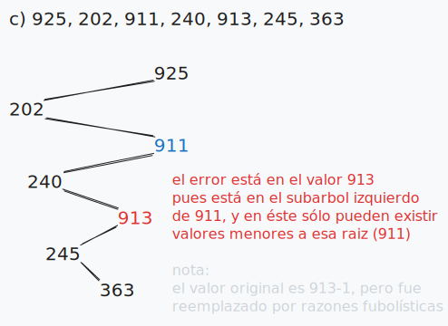
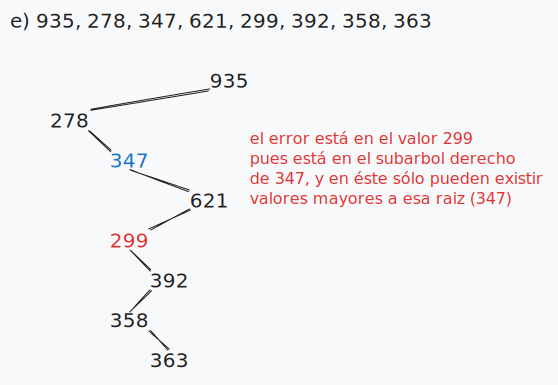

## Ejercicio 6
En un ABB cuyos nodos poseen valores entre 1 y 1000, interesa encontrar el número 363. ¿Cuáles de las siguientes secuencias no puede ser una secuencia de nodos examinados según el algoritmo de búsqueda? ¿Por qué?<br>
a) 2, 252, 401, 398, 330, 344, 397, 363.<br>
b) 924, 220, 911, 244, 898, 258, 362, 363.<br>
c) 925, 202, 911, 240, 912, 245, 363.<br>
d) 2, 399, 387, 219, 266, 382, 381, 278, 363.<br>
e) 935, 278, 347, 621, 299, 392, 358, 363.

```
a), b) y d) son las secuencias permitidas para encontrar el número 363 en un ABB.

c) y e) NO lo son, veamos con gráficos el por qué:
```


