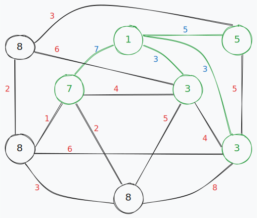

## Ejercicio 2
Ejecutar paso a paso el algoritmo de Dijkstra que computa el camino de costo mínimo entre un nodo dado y los restantes nodos de un grafo, sobre los dos grafos especificados en el ejercicio anterior.

Considerar 1 como el nodo inicial. Explicitar en cada paso el conjunto de nodos para los cuales ya se ha computado el costo mínimo y el arreglo con tales costos.

```
a)
w((1, 2)) = 7       w((2, 3)) = 4       w((3, 6)) = 4       w((5, 6)) = 6
w((1, 6)) = 3       w((2, 4)) = 2       w((3, 8)) = 6       w((6, 7)) = 5
w((1, 7)) = 5       w((2, 5)) = 1       w((4, 6)) = 8       w((8, 5)) = 2
w((1, 3)) = 3       w((3, 4)) = 5       w((5, 4)) = 3       w((8, 7)) = 3
```
<br>
<br>
<br>
<br>
<br>
<br>
<br>
<br>
<br>
<br>


``` 
b)
w((1, 2)) = 3       w((2, 3)) = 1       w((3, 6)) = 3       w((5, 6)) = 6
w((1, 6)) = 2       w((2, 4)) = 1       w((3, 8)) = 7       w((6, 7)) = 6
w((1, 7)) = 8       w((2, 5)) = 5       w((4, 6)) = 1       w((8, 5)) = 1
w((1, 3)) = 1       w((3, 4)) = 9       w((5, 4)) = 2       w((8, 7)) = 5
```
<br>
<br>
<br>
<br>
<br>
<br>
<br>
<br>
<br>
<br>
<br>
